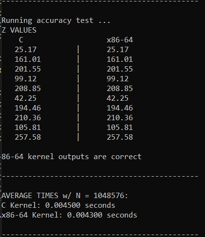
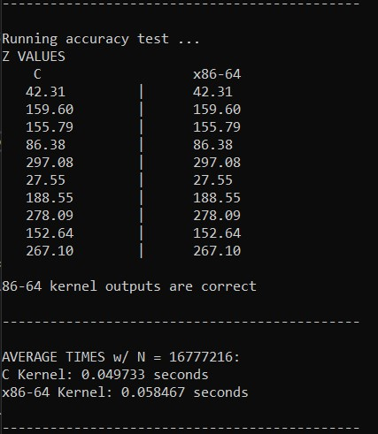
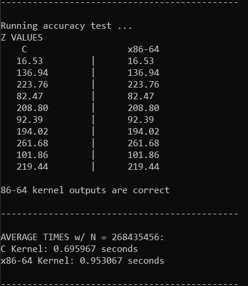

# LBYARCH x86 to C Interface Programming Project

### Program Implementation

The group conducted execution tests with values of `N` up to `2^28`. If `2` were raised to any higher power, the program would run without crashing but would take an unreasonable amount of time to complete execution.

The `X` and `Y` vectors (represented as arrays in this program) were populated randomly with double-precision floating point values from `0` to `100.0`. 

A seed was used via the `srand()` function to ensure that the vectors were filled with the same values at every execution for testing purposes. If the user wishes to populate the vectors with different values at every execution, `srand()` could be given the parameter `time(NULL)` ( i.e., `srand(time(NULL))` ).

It is worth noting that in the group's original implementation, the largest vector size that could be accomodated was `2^25`. This is likely due to the stack memory being filled with the plethora of variables and function calls used within the program. 

But after switching from static memory allocation to dynamic memory allocation in C, the group was able to raise the cap on `N` from `2^25` to `2^28`. 

### Performance Analysis

After conducting several tests with vector sizes `n = {2^20, 2^24, and 2^28}`, the C-based implementation of the DAXPY function consistently ran faster than the x86-64-based implementation. 

This is likely due to the group's x86-64 implementation requiring two function calls—`scalarMultiply` and `vectorAddition`—rather than just one in the C implementation.

The screenshots below showcase evidence of runtime and correctness checks for all three variables:

for `N = 2^20`

for `N = 2^24`

for `N = 2^28`

